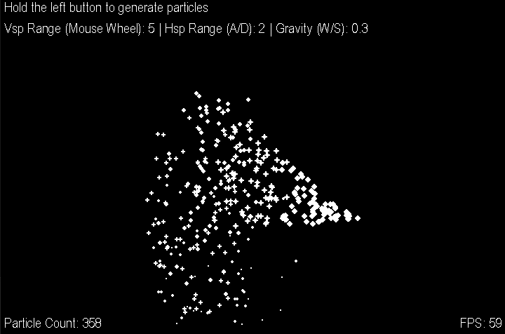

# Pygame Particles
A particle system made with Python using Pygame Library

</img>

## How to use
<ul>
  <li>Hold the left mouse button to generate particles</li>
  <li>Use the Mouse wheel to change the Vspeed range</li>
  <li>A/D to change the Hspeed range</li>
  <li>W/S to change the gravity</li>
</ul>

## Requirements
<ul>
  <li><a href="https://www.python.org/">Python</a></li>
  <li><a href="https://www.pygame.org/wiki/GettingStarted">Pygame</a></li>
</ul>
